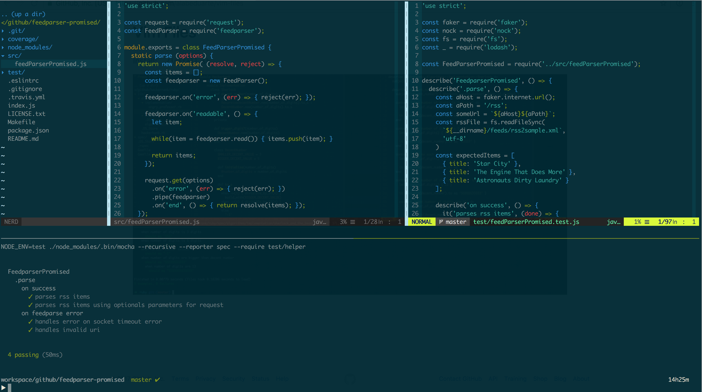

dot-files
========

### Install

```
$ make install
```



### Uninstall

```
$ make uninstall
```

#### TODO: migrate setup files from my_mac_os_apps repo

1. https://github.com/alabeduarte/mypodcasts-api
2. https://github.com/alabeduarte/vim-files
3. https://github.com/alabeduarte/tmux-config
